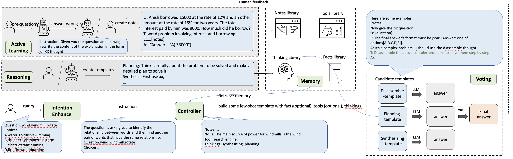

# OlaGPT: Empowering LLMs With Human-like Problem-Solving Abilities

OlaGPT carefully studied a cognitive architecture framework, and
propose to simulate certain aspects of human cognition. Check out our [paper](https://arxiv.org/abs/2305.16334) for more information.



## Requirements

```
python3.8
openai
langchain
datasets
faiss-cpu
```

## Usage

Several important parameters:
- **is_eval**: whether it is evaluation mode.
- **question**: valid when is_eval is False, suitable for testing a single question.
- **eval_full**: whether to evaluate all data.
- **eval_num**: valid when eval_full is False, can specify how many data to evaluate.
- **is_random**: valid when eval_full is False, controls whether to randomly select eval_num data.
- **n_split**: parallelism during evaluation, the higher the value, the higher the parallelism, but be aware of API concurrency limits.
- **model_name**: controls the output path in prediction.


## Quick Start

### OlaGPT
```    
python agents/multi_actions_agent.py --is_eval=True --dataset=aqua --model_name=cos --eval_full=True --n_split=30
```

### Single Template
```
python agents/single_action_agent.py --is_eval=True --dataset=aqua --model_name=st --eval_full=True --n_split=30
```

## More details
- **definitions**：[utils/parser.py](utils/parser.py)
- **examples**：
  - run OlaGPT
    - [run-cos.sh](run-cos.sh)
  - run Single Template
    - [run-zeroshot.sh](run-zeroshot.sh)
    - [run-random.sh](run-random.sh)
    - [run-retrieval.sh](run-retrieval.sh)
    - [run-combine.sh](run-combine.sh)

## Citing OlaGPT
```
@article{xie2023olagpt,
  title={OlaGPT: Empowering LLMs With Human-like Problem-Solving Abilities}, 
  author={Yuanzhen Xie and Tao Xie and Mingxiong Lin and WenTao Wei and Chenglin Li and Beibei Kong and Lei Chen and Chengxiang Zhuo and Bo Hu and Zang Li},
  journal={arXiv preprint arXiv:2305.16334},
  year={2023}
}
```

## License
This project is licensed under the Apache-2.0 License.
